# Google Desktop OAuth client setup

This walkthrough creates the Google Desktop OAuth client used by the Hermes
Chief of Staff demo. Use a dedicated test or demo Google account: the demo can
create and permanently remove tracked Gmail messages, create and move Calendar
events, and create or update Drive, Docs, Sheets, and Slides files.

This procedure was validated end to end on Windows on August 22, 2026.

The Google Cloud free-trial prompt is unrelated to this setup. You do not need
to start the trial to configure OAuth or use these Google Workspace APIs.

## What is safe to show

A Google Cloud project name, project ID, and OAuth client ID identify resources;
they are not passwords and do not grant access by themselves. They can appear in
setup screenshots. Use a generic project ID because it is globally unique and
cannot be changed after the project is created.

Never publish or share any of the following:

- An OAuth client secret or the contents of the downloaded client JSON.
- An OAuth authorization code or the full `http://localhost:1/...` redirect URL.
- An access token, refresh token, or `google_token.json`.
- Private account email addresses unless sharing them is intentional.

## 1. Create or select a Google Cloud project

1. Open the [Google Cloud Console](https://console.cloud.google.com/).
2. Click the project selector in the top bar.
3. Select a project dedicated to the demo, or click **New project**.

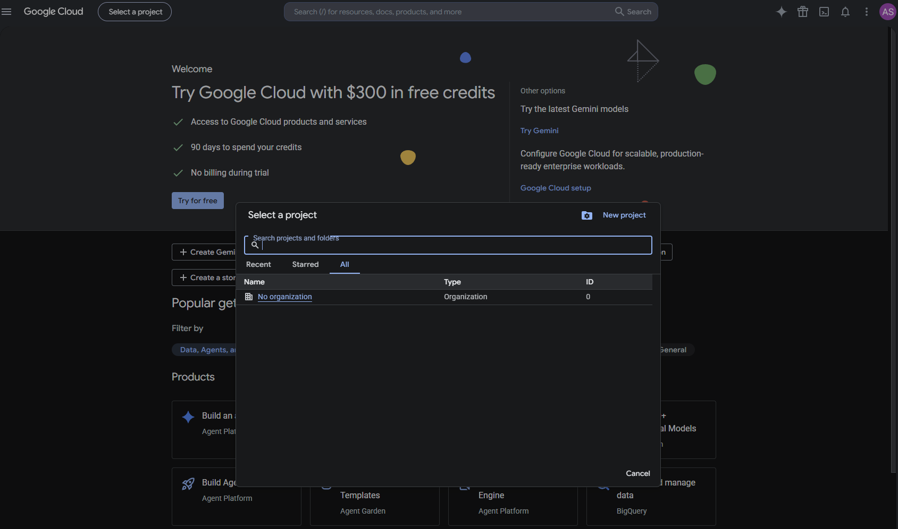

For a new project:

1. Set **Project name** to a recognizable name such as
   `Hermes Chief of Staff Demo`.
2. Accept the generated project ID or enter a short generic ID.
3. Leave **Parent resource** as **No organization** for a personal Google
   account. For a managed Google Workspace account, use the organization your
   administrator requires.
4. Click **Create**.

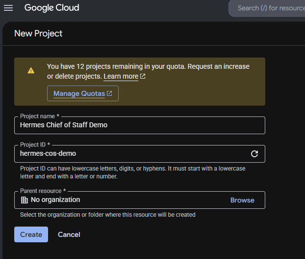

Wait for creation to finish, then confirm that the project name appears in the
top bar before continuing.

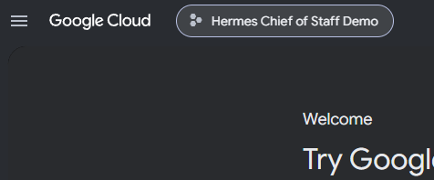

## 2. Enable the six Google Workspace APIs

In the selected project, open **Menu > APIs & Services > Library**. Search for
each API below, open its result, and click **Enable**:

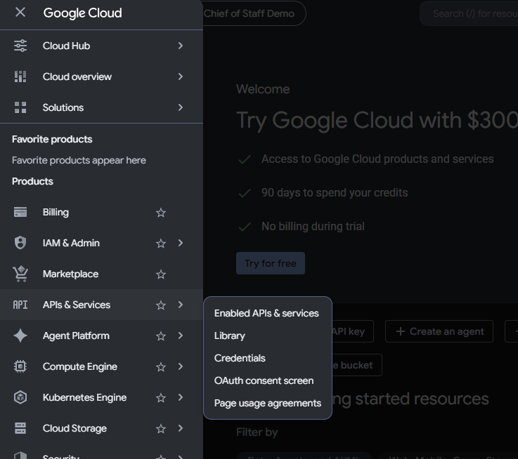

- Gmail API
- Google Calendar API
- Google Drive API
- Google Docs API
- Google Sheets API
- Google Slides API

Choose the result with the exact API name. For example, select **Gmail API**,
not a similarly named result such as **Gmail MCP API**.

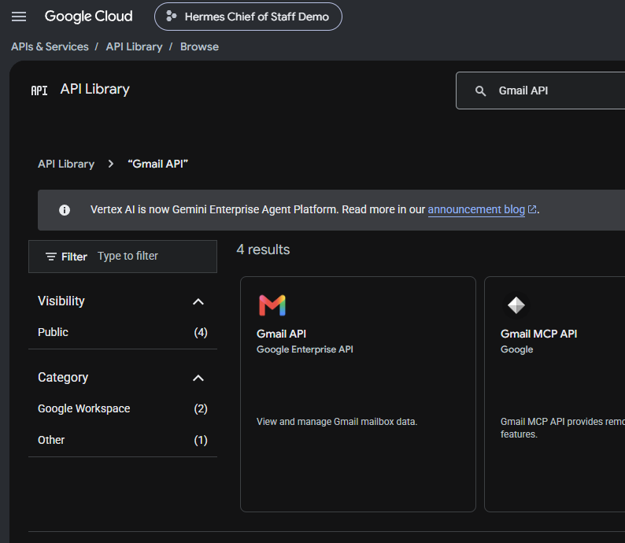

On a service that has not been activated, the product-details page initially
shows an **Enable** button. Click it and wait for activation. Afterward, the page
shows **Manage** and **API Enabled**, as in the example below. Repeat this for
all six APIs.

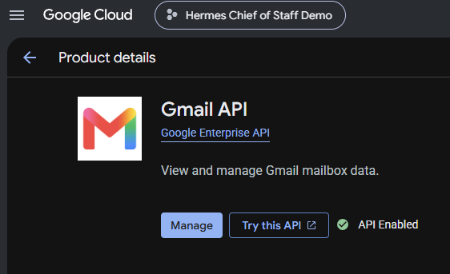

Afterward, open **APIs & Services > Enabled APIs & services** and confirm that
all six appear. Enabling similarly named products is not sufficient; use the
exact API names above.

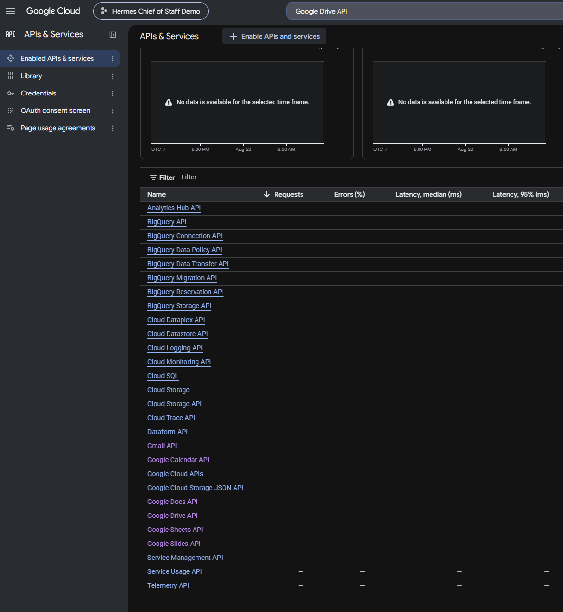

Google's current API-library instructions are available in
[Enable Google Workspace APIs](https://developers.google.com/workspace/guides/enable-apis).

## 3. Configure the OAuth consent screen

Open **Menu > Google Auth Platform**. If the platform is not configured, click
**Get started** and enter:

1. **App name:** `Hermes Chief of Staff Demo`
2. **User support email:** an address you control.
3. **Audience:**
   - Choose **Internal** only when the Cloud project and every demo account are
     in the same Google Workspace organization.
   - Otherwise choose **External**.
4. **Contact information:** an address you monitor for project notices.
5. Review the Google API Services User Data Policy, accept it if appropriate,
   and create the app configuration.

For a personal or standalone project, select **External**. This starts the app
in Testing and limits authorization to accounts explicitly added as test users.

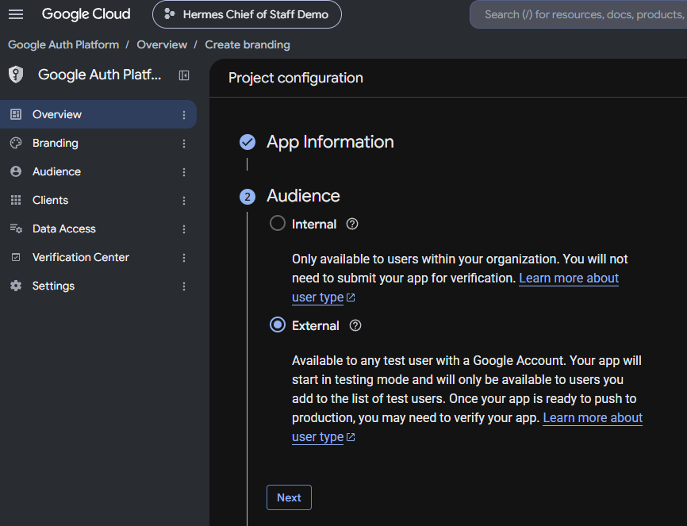

For an **External** app left in **Testing**, open **Google Auth Platform >
Audience**, click **Add users**, and add the exact Google account that will run
the demo. Add any planned backup demo account at the same time. Testing
authorization and its refresh token expire after seven days, so repeat the
authorization flow shortly before a later demo when necessary.

Confirm that the page shows **Publishing status: Testing**, **User type:
External**, and the demo account under **Test users**. Do not click **Publish
app** or submit the project for verification merely to run this private demo.
Distribution to users outside the configured audience is a separate deployment
decision.

See Google's current [Google Auth Platform setup](https://support.google.com/cloud/answer/15544987?hl=en)
and [audience guidance](https://support.google.com/cloud/answer/15549945?hl=en).

## 4. Declare the required data-access scopes

For an External app, open **Google Auth Platform > Data Access**, click **Add or
remove scopes**, and add these exact scope values:

```text
https://mail.google.com/
https://www.googleapis.com/auth/calendar
https://www.googleapis.com/auth/drive
https://www.googleapis.com/auth/spreadsheets
https://www.googleapis.com/auth/documents
https://www.googleapis.com/auth/presentations
```

If a scope does not appear in the table, add it under **Manually add scopes**.
Click **Add to table**, **Update**, and then **Save**.

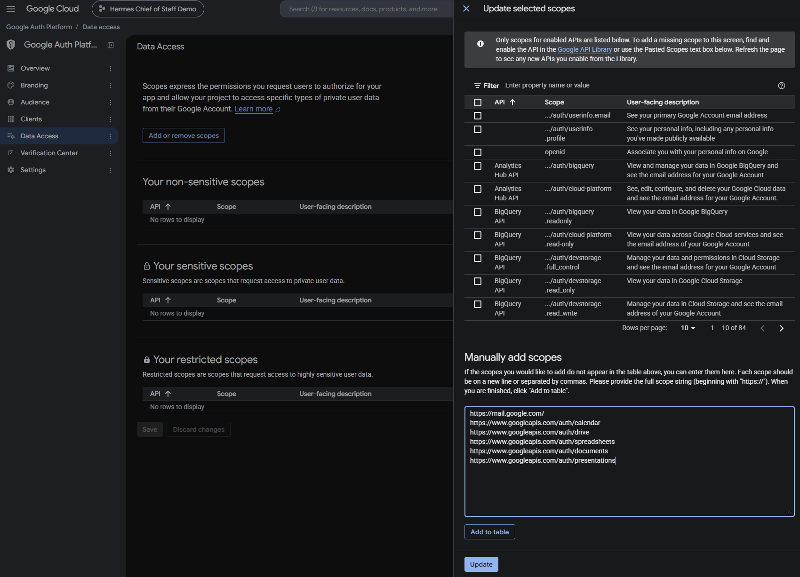

After saving, confirm that Calendar, Docs, Sheets, and Slides appear under
**Your sensitive scopes**, while Drive and full Gmail access appear under
**Your restricted scopes**.

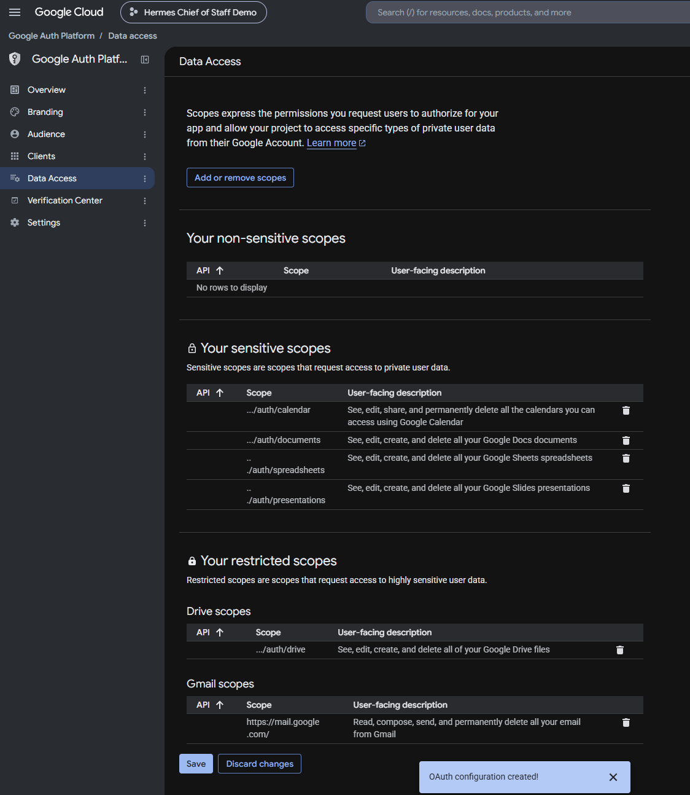

Full Gmail access is intentional for this reference demo. It lets cleanup
permanently delete only the exact seeded message IDs instead of leaving deleted
message placeholders in Gmail conversations. This is the main reason to use a
dedicated demo account.

Google categorizes some of these permissions as sensitive or restricted. A
private External app in Testing can show an unverified-app warning to its listed
test users. Verify that the warning names your own Cloud project before
continuing. See [Manage App Data Access](https://support.google.com/cloud/answer/15549135?hl=en).

## 5. Create and download the Desktop client

1. Open **Google Auth Platform > Clients**.
2. Click **Create client**.
3. Set **Application type** to **Desktop app**.
4. Name it `Hermes Chief of Staff Desktop`.
5. Click **Create**.
6. Download the client JSON immediately and keep it outside the repository.

The completed form should show **Desktop app** as the application type. Desktop
clients do not display redirect-URI fields in this form.

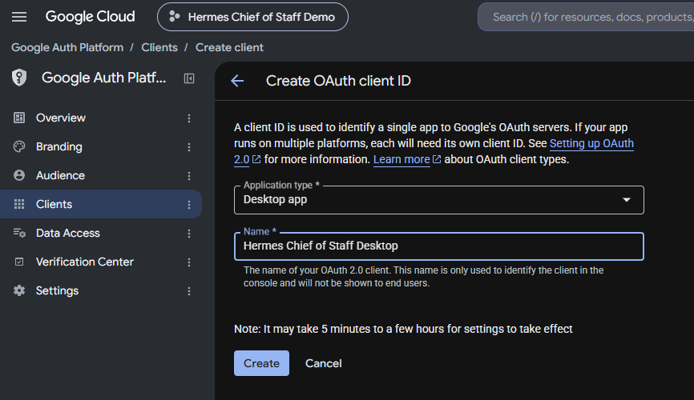

After creation, confirm that `Hermes Chief of Staff Desktop` appears under
**OAuth 2.0 Client IDs**.

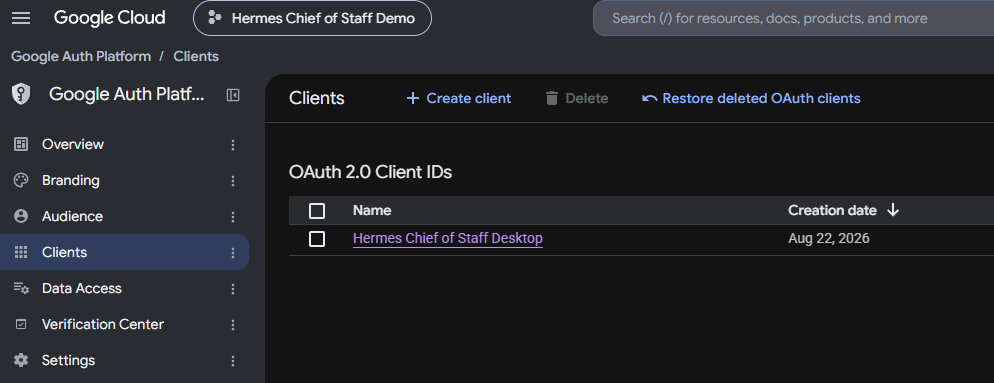

A Desktop client does not require you to enter an authorized redirect URI in
the console. The demo's OAuth helper uses the Desktop client's loopback redirect
automatically. Google's current instructions are in
[Create access credentials](https://developers.google.com/workspace/guides/create-credentials#desktop-app).

Do not open the JSON in a screenshot or paste it into an issue, chat, commit, or
setup log. The repository ignores common client-secret filenames, but the file
should still remain outside the checkout.

## 6. Store the client and authorize the demo account

The commands below assume that the project environment and `HERMES_HOME` were
configured as described in the main README.

### Windows PowerShell

Replace the example path with the downloaded JSON's real path:

```powershell
& $Python setup\google-workspace\setup.py --client-secret "C:\Users\YOUR_NAME\Downloads\client_secret.json"
$AuthUrl = & $Python setup\google-workspace\setup.py --auth-url
Start-Process $AuthUrl
```

The first command should report that the client secret was saved under the
local Hermes profile. Assigning the authorization URL to `$AuthUrl` prevents
the URL itself from appearing in the terminal or a setup screenshot.

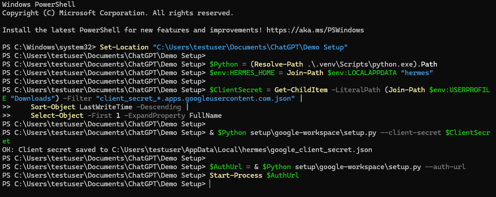

### Linux or macOS

```bash
python setup/google-workspace/setup.py --client-secret "/path/to/client_secret.json"
python setup/google-workspace/setup.py --auth-url
```

In the browser:

1. Select the same Google account configured as the app's Internal user or
   External test user.
2. Verify that the consent screen names your project.
3. Approve every requested permission, including full Gmail access.
4. Google redirects to a URL beginning with `http://localhost:1/`. The browser
   may say that it cannot connect; this is expected because no server is
   listening there.
5. Copy the entire URL from the browser address bar, including its `state` and
   `code` parameters. Treat this URL as a short-lived secret and exchange it
   immediately.

Finish authorization on Windows:

```powershell
$RedirectSecure = Read-Host "Paste the full localhost redirect URL" -AsSecureString
$RedirectUrl = [System.Net.NetworkCredential]::new("", $RedirectSecure).Password
& $Python setup\google-workspace\setup.py --auth-code $RedirectUrl
Remove-Variable RedirectUrl, RedirectSecure
& $Python setup\google-workspace\setup.py --check-live
& $Python (Join-Path $env:HERMES_HOME "skills\productivity\ingest\scripts\verify.py")
```

Secure input masks the pasted one-time redirect URL and keeps it out of
PowerShell command history.

Or on Linux/macOS:

```bash
python setup/google-workspace/setup.py --auth-code "FULL_LOCALHOST_REDIRECT_URL"
python setup/google-workspace/setup.py --check-live
python "$HERMES_HOME/skills/productivity/ingest/scripts/verify.py"
```

The authorization URL and code are single-use. If the exchange fails or reports
an OAuth state mismatch, generate a new URL with `--auth-url` and use only the
redirect produced by that attempt.

## 7. Confirm success

Setup is complete when:

- `--check-live` prints `LIVE_CHECK_OK`.
- The verifier reports successful access for Gmail, Calendar, Drive, Docs,
  Sheets, and Slides.
- `google_client_secret.json` and `google_token.json` exist only under the local
  `HERMES_HOME` and are not tracked by Git.

An empty demo account can report zero sample items or `no_file_available`. Those
values are expected when the surrounding service has `"ok":true`.

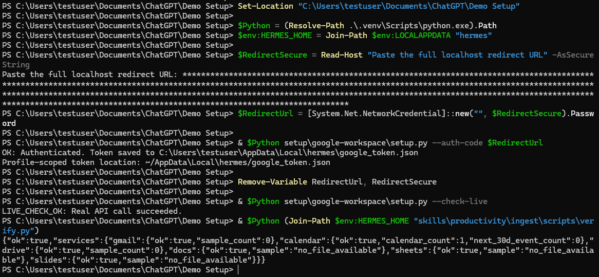

Do not seed the reference workspace until all six service checks succeed.

After the optional reference workspace is seeded, run the verifier again. A
successful seeded check reports readable samples for every service. Calendar
counts cover every visible calendar in the account, so a holidays or secondary
calendar can make the total slightly higher than the demo's 47 meeting
instances.

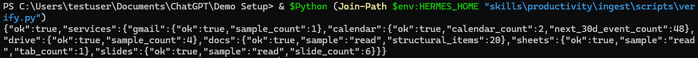

## 8. Switch or fail over to another Google account

The OAuth token and `chief-of-staff-workspace-state.json` both live under the
active `HERMES_HOME`, but changing the OAuth account does not automatically
replace or remove the previous account's workspace state. A stale state file
therefore blocks a second seed even when the newly connected account is empty.

Before demo day:

1. Add both the primary and backup demo accounts under **Google Auth Platform >
   Audience > Test users**.
2. Authorize the account you plan to use within seven days of the demo because
   External Testing refresh tokens expire after seven days.
3. Run the live check and six-service verifier after every account change.

For a planned switch while the current account is accessible:

1. Run cleanup while OAuth still points to the account that owns the seeded
   workspace:

   ```powershell
   & $Python demo\seed_workspace.py --cleanup --confirm
   ```

2. Do not continue until cleanup reports `"ok": true` and `"status":
   "removed"`.
3. Repeat the authorization flow in section 6 and select the backup test user.
4. Repeat the live verification in section 7.
5. Seed the backup account for the intended workweek.

If the previous account is suspended or otherwise inaccessible, its resources
cannot be cleaned through the new account. Preserve the old state under a unique
archive name instead of deleting it:

```powershell
$StatePath = Join-Path $env:HERMES_HOME "chief-of-staff-workspace-state.json"
$State = Get-Content -LiteralPath $StatePath -Raw | ConvertFrom-Json
$ArchiveName = "chief-of-staff-workspace-state.stale-{0}-{1}.json" -f `
    (Get-Date -Format "yyyyMMdd-HHmmss"), $State.seed_run_id
$ArchivePath = Join-Path $env:HERMES_HOME $ArchiveName
if (Test-Path -LiteralPath $ArchivePath) { throw "Archive already exists: $ArchivePath" }
Move-Item -LiteralPath $StatePath -Destination $ArchivePath
Write-Output "Archived stale state at $ArchivePath"
```

Confirm that the command reports the archive path and that the original active
state path no longer exists.

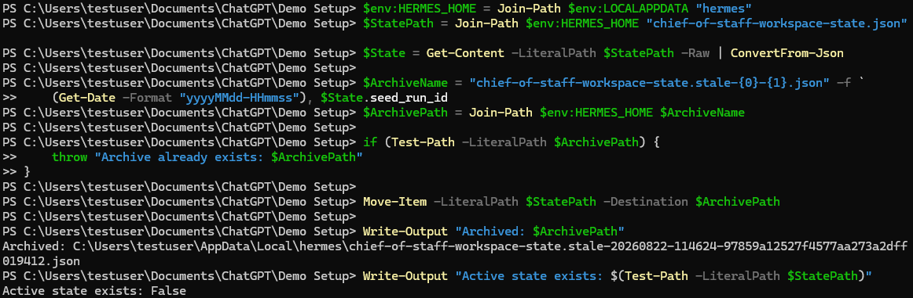

Archiving removes only the active local blocker. It does not delete anything in
the unavailable account. Keep the archive outside Git so those exact resource
IDs remain available if account access is restored later. After archiving,
authorize and verify the backup account before running a new seed.
